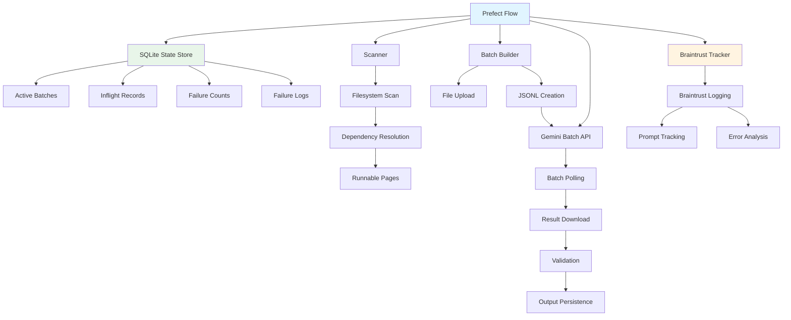

# Gemini OCR Batch Processing

A production-ready system for large-scale OCR processing of historical course catalogs using Google's Gemini Batch API, orchestrated with **Prefect** for scalable batch job management and integrated with **Braintrust** for comprehensive observability and prompt engineering capabilities.

## Overview

This system processes thousands of page-level OCR inferences across multi-book datasets, handling partial failures, retries, and page-to-page dependencies. It transforms synchronous, single-threaded inference into a robust, resumable batch processing pipeline that can run for hours or days while maintaining full observability and prompt versioning.

### Key Value Propositions

- **Scalable Batch Processing with Prefect**: Resumable state management, concurrent batch execution, and automatic retry handling
- **Full Observability with Braintrust**: Automatic logging of all inference calls with complete context, enabling prompt engineering and performance analysis
- **Dependency-Aware Execution**: Handles page-to-page context dependencies through a "wave execution" strategy
- **Production-Ready**: Idempotent, crash-recoverable, and designed for long-running operations

## Key Features

### Prefect Orchestration

- **Resumable State Management**: SQLite-backed state store tracks active batches, inflight records, and failure counts
- **Concurrent Batch Processing**: Supports multiple concurrent batches with configurable limits
- **Automatic Retry & Failure Handling**: Record-level retries with configurable max attempts and dead-letter queue
- **Prefect UI Monitoring**: Visual artifacts, logs, and batch summaries for operational visibility

### Braintrust Integration

- **Automatic Logging**: All inference calls are automatically logged to Braintrust with full context
- **Prompt Versioning & Tracking**: Tracks prompt templates, versions, and configurations for each inference
- **Full Context Capture**: Logs inputs (prompts, previous context, generation config), outputs (validated results), metadata (batch_id, page info, model), and errors (full tracebacks, raw responses)
- **Error Tracking & Analysis**: Comprehensive failure logging enables offline analysis and pattern identification

### Core Capabilities

- **Dependency-Aware Processing**: Pages can depend on previous page outputs, automatically resolved through filesystem state
- **Partial Failure Handling**: Record-level retries (not batch-level), allowing successful records to proceed while failed ones retry
- **Wave Execution Strategy**: Scans for runnable pages, batches them across different books, and persists results to unlock dependent pages

## Architecture



### Key Components

- **Prefect Flow** (`orchestrate_gemini_batch`): Main orchestration loop that manages batch lifecycle
- **SQLite State Store**: Tracks active batches, inflight records, failure counts, and comprehensive failure logs
- **Braintrust Tracker**: Automatic logging wrapper that captures all inference context
- **Scanner**: Filesystem-based dependency resolution to identify runnable pages
- **Batch Builder & API Client**: Constructs batch requests and manages Gemini API interactions

## Braintrust Integration

### How It Works

Braintrust is integrated at multiple levels to provide comprehensive observability:

1. **Wrapper Setup** (`src/gemini_client.py`): Uses `braintrust.wrappers.google_genai.setup_genai()` to automatically wrap Gemini API calls
2. **Batch Tracker** (`src/tracking.py`): `BatchBraintrustTracker` class provides a safe wrapper for logging in batch flows
3. **Automatic Logging** (`src/flow.py`): After each batch completes, all records are logged to Braintrust with full context

### What Gets Logged

Each inference call logs:

- **Inputs**: Page ID, rendered prompt, previous page context, generation configuration
- **Outputs**: Validated OCR results (when successful)
- **Metadata**: Batch ID, state/school/year/page, model name, prompt name and template
- **Errors**: Full error context including error type, message, traceback, raw response JSON/text
- **Metrics**: Success flag, attempt number

### Prompt Engineering Capabilities

The system includes a full prompt registry system:

- **Prompt Registry** (`prompts/page_ocr/`): Organized directory structure for prompt templates
- **Version Tracking**: Multiple versions (v1, v1.1, etc.) tracked per prompt name
- **Jinja2 Templates**: Template-based prompt generation with variable substitution
- **Context-Aware Prompts**: Automatically includes previous page context when available

Example prompt structure:

```
prompts/
└── page_ocr/
    ├── v1.jinja
    ├── v1.1.jinja
    └── README.md
```

Each logged inference includes the prompt template name and version, enabling:

- A/B testing of prompt versions
- Performance comparison across prompt iterations
- Debugging prompt-related failures
- Tracking prompt evolution over time

### Configuration

Set these environment variables to enable Braintrust:

```bash
BRAINTRUST_PROJECT_NAME=your-project-name
BRAINTRUST_API_KEY=your-api-key
```

The tracker gracefully degrades if Braintrust is not configured, ensuring the system works without it.

## Prefect Integration

### Flow Structure

The main Prefect flow (`orchestrate_gemini_batch`) implements a state machine pattern:

1. **Service Active Batches**: Polls Gemini API for batch completion status
2. **Process Results**: Downloads and validates results, updates state store
3. **Submit New Batches**: Scans for runnable work and fills available slots
4. **Loop Until Complete**: Continues until no active batches and no runnable work

### State Management

All state is managed in a SQLite database (`data/gemini_batches.db`):

- **`active_batches`**: Currently running batch IDs
- **`batch_record_keys`**: Mapping of batch IDs to their record keys
- **`inflight_records`**: Record keys currently being processed (prevents double-submission)
- **`failure_counts`**: Retry counts per record (enables dead-letter logic)
- **`failure_logs`**: Comprehensive failure logs with full context for debugging

### Observability Features

- **Prefect Artifacts**: Markdown summaries and table artifacts showing batch results
- **Structured Logging**: Logs include record IDs, retry counts, and batch-level metrics
- **Flow Run Timeline**: Complete execution history in Prefect UI
- **Task Retries**: Automatic retries for network/infrastructure failures

### Deployment & Scheduling

The flow can be:

- Run once via CLI: `uv run python -m src.cli run-once`
- Scheduled via Prefect: Configure `schedule_interval_minutes` in config
- Deployed as a Prefect deployment for production use

## Setup & Configuration

### Prerequisites

- Python 3.14+
- [uv](https://github.com/astral-sh/uv) package manager
- Google Gemini API key
- (Optional) Braintrust API key for observability

### Installation

```bash
# Clone the repository
git clone <repository-url>
cd gemini-ocr-batch

# Install dependencies
uv sync

# Set up environment variables
cp .env.example .env
# Edit .env and add your GEMINI_API_KEY
# Optionally add BRAINTRUST_PROJECT_NAME and BRAINTRUST_API_KEY
```

### Configuration

Edit `config.yaml` to configure:

- **Paths**: Source directories for labels, images, and output
- **Filters**: Target states and year ranges to process
- **Execution**: Max retries, batch size limits, concurrent batches
- **Model**: Gemini model name and generation parameters
- **Prompt**: Prompt registry directory, name, and template file

Example configuration:

```yaml
paths:
  label_source_dir: "dataset/label_to_curricular"
  image_source_dir: "dataset/raw_image_dataset"
  output_dir: "dataset/output_results"

filters:
  target_states: ["Alabama", "California"]
  target_years:
    start: 1849
    end: 1852

execution:
  max_retries: 3
  batch_size_limit: 100
  max_concurrent_batches: 10

model:
  name: "gemini-2.5-flash"
  generation_config:
    temperature: 0.1
    max_output_tokens: 8192

prompt:
  registry_dir: "prompts"
  name: "page_ocr"
  template_file: "v1.1.jinja"
```

## Usage

### Running the Flow

```bash
# Run once (processes available work and exits)
uv run python -m src run-once

# Or run directly with Prefect
uv run prefect flow run orchestrate_gemini_batch
```

### Monitoring

- **Prefect UI**: View flow runs, artifacts, and logs at `http://localhost:4200` (if running locally)
- **Braintrust Dashboard**: View all logged inferences, analyze prompt performance, and debug failures
- **Database**: Query SQLite database directly for state information

### Utility Scripts

The `scripts/` directory contains utilities for common operations:

- **`analyze_failures.py`**: Analyze failure patterns and export to CSV
- **`clear_failure_counts.py`**: Reset retry counts for failed records
- **`nuke_database.py`**: Reset the entire database (use with caution)

## Project Structure

```
gemini-ocr-batch/
├── src/
│   ├── flow.py              # Main Prefect flow
│   ├── tracking.py          # Braintrust tracker
│   ├── gemini_client.py     # Braintrust wrapper setup
│   ├── scanner.py           # Dependency resolution
│   ├── batch_builder.py     # Batch construction
│   ├── batch_api.py         # Gemini Batch API client
│   ├── results.py           # Result validation
│   ├── prompting.py         # Prompt template management
│   └── prefect_state.py     # SQLite state store
├── prompts/
│   └── page_ocr/            # Prompt registry
├── dataset/
│   ├── label_to_curricular/ # Input allow-list
│   ├── raw_image_dataset/   # Source images
│   └── output_results/      # Successful outputs
├── data/
│   └── gemini_batches.db    # SQLite state database
├── config.yaml              # Configuration file
└── design_docs/             # Architecture documentation
```

## Design Principles

- **Filesystem as Source of Truth**: Workload defined by filesystem structure, completion marked by output files
- **Record-Level State**: Each page tracked independently, enabling selective retries
- **Idempotency**: System can be interrupted and resumed without losing progress
- **Observability First**: Comprehensive logging enables debugging and analysis without re-running batches

For detailed architecture documentation, see the `design_docs/` directory.
