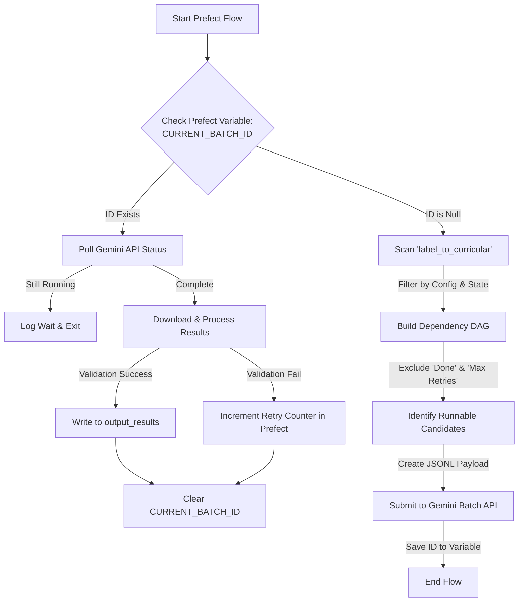

# 01. Architecture & Design Principles

## 1. Design Principles

1.  **Source of Truth = Filesystem (Input):** The workload is defined strictly by the existence of JSON files in `dataset/label_to_curricular`.
2.  **Definition of Done = Filesystem (Output):** A page is considered "Done" **only** if a valid JSON file exists in `dataset/output_results`.
3.  **State Management = Prefect Backend:** We use **Prefect Variables** to track "In-Flight" Batch IDs and "Retry Counts." We do not write metadata files to disk.
4.  **Idempotency & Resiliency:** The flow is designed to be interrupted at any moment. Upon restart, it queries Prefect Variables to resume the state (e.g., check the status of a remote Gemini batch) rather than starting over.
5.  **Natural Retry Loop:** If a record fails validation, we do not save the output. The next "Scan" phase naturally detects it as "Pending" and queues it again, subject to a Max Retry limit stored in Prefect.

## 2. High-Level Diagram

The system runs as a single Prefect Deployment on a scheduled interval (e.g., every 10 minutes).



## 3. System Layers

| Layer | Component | Responsibility |
| :--- | :--- | :--- |
| **Config** | `config.yaml` + `.env` | YAML file for all settings, `.env` for secrets (API keys). Validated via Pydantic models. |
| **Orchestration** | **Prefect Flow** | Manages the loop. Stores state in Prefect SQLite/Postgres (Variables). |
| **Workload** | `dataset/label_to_curricular` | The "Allow List". Defines what *should* exist. |
| **Assets** | `dataset/raw_image_dataset` | Read-only image source. |
| **Results** | `dataset/output_results` | The permanent record of successful extractions. |
| **Observability**| **Prefect UI** | Logs specific Record IDs, Retry counts, and Batch-level success rates. |
```
